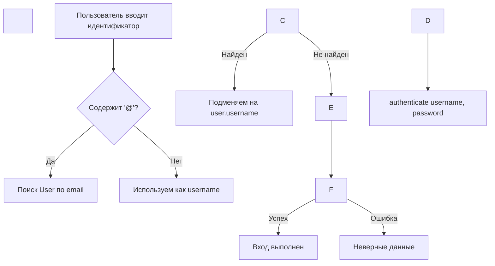

\# Устранение ошибок CSRF и аутентификации в Django-проекте KMPC Task Manager


\*\*Дата:\*\* 14 ноября 2025  

\*\*Автор:\*\* Aleksan Jhangiryan  

\*\*Решенные проблемы:\*\* CSRF Origin Checking Failed, Email-based Authentication


---


\## Оглавление


1\. \[Проблема №1: Ошибка CSRF при отправке формы логина](#проблема-1-ошибка-csrf-при-отправке-формы-логина)

2\. \[Проблема №2: Невозможность входа по email](#проблема-2-невозможность-входа-по-email)

3\. \[Архитектурные решения и best practices](#архитектурные-решения-и-best-practices)

4\. \[Инструкции по применению изменений](#инструкции-по-применению-изменений)

5\. \[Тестирование и верификация](#тестирование-и-верификация)


---


\## Проблема №1: Ошибка CSRF при отправке формы логина


\### Симптомы


При попытке отправить форму логина на `http://localhost:8000/accounts/login/` пользователь получал ошибку \*\*403 Forbidden\*\*:


```

Ошибка проверки CSRF. Запрос отклонён.

Reason: Origin checking failed - http://localhost:8000 does not match any trusted origins.

```


\### Причина


Django 4.0+ усилил проверку CSRF-токенов для защиты от cross-site атак. При работе через reverse proxy (Nginx) возникла проблема с заголовком `Host`:


1\. \*\*Браузер отправляет\*\* заголовок `Origin: http://localhost:8000` (включает порт)

2\. \*\*Nginx проксирует\*\* запрос к Django с заголовком `Host: localhost` (без порта, используя `$host`)

3\. \*\*Django сравнивает\*\* `Origin` с `Host` и обнаруживает несовпадение (порт присутствует в Origin, но отсутствует в Host)

4\. \*\*Результат:\*\* CSRF validation fails


\### Техническое объяснение


В файле `django/middleware/csrf.py` происходит следующая проверка:


```python

\# Псевдокод Django CSRF middleware

request\_origin = request.META.get('HTTP\_ORIGIN')

request\_host = request.META.get('HTTP\_HOST')  # Получено от Nginx


if request\_origin != f"{request.scheme}://{request\_host}":

&nbsp;   raise CsrfError("Origin checking failed")

```


Когда Nginx передавал `Host: localhost` (без порта), Django ожидал `Origin: http://localhost`, но получал `Origin: http://localhost:8000`.


\### Решение


Реализовано \*\*двухуровневое решение\*\* для максимальной совместимости:


\#### 1. Исправление Nginx-конфигурации


\*\*Файл:\*\* `docker/nginx/nginx.conf:13`


```diff

\- proxy\_set\_header Host $host;

\+ proxy\_set\_header Host $http\_host;

```


\*\*Обоснование:\*\*

\- `$host` — содержит только hostname без порта (например, `localhost`)

\- `$http\_host` — содержит полное значение заголовка `Host` от клиента, включая порт (например, `localhost:8000`)


Это обеспечивает точное соответствие между `Origin` и `Host`, которые видит Django.


\#### 2. Добавление CSRF\_TRUSTED\_ORIGINS (страховочная сетка)


\*\*Файл:\*\* `kapantask/settings.py:19-26`


```python

\# Доверенные источники для CSRF-проверок (разработка)

CSRF\_TRUSTED\_ORIGINS = env.list(

&nbsp;   "DJANGO\_CSRF\_TRUSTED\_ORIGINS",

&nbsp;   \[

&nbsp;       "http://localhost:8000",

&nbsp;       "http://127.0.0.1:8000",

&nbsp;   ]

)

```


\*\*Обоснование:\*\*

\- Предоставляет явный whitelist доверенных origins

\- Решает edge cases, где схема (http/https) или hostname могут различаться

\- Читается из переменной окружения для гибкости конфигурации


\*\*Для production/HTTPS:\*\*

```bash

\# В .env или docker-compose.yml

DJANGO\_CSRF\_TRUSTED\_ORIGINS=https://kapantask.local,https://yourdomain.com

```


\### Ссылки на код


\- \*\*Настройка CSRF:\*\* \[`kapantask/settings.py:19-26`](kapantask/settings.py#L19-L26)

\- \*\*Конфигурация Nginx:\*\* \[`docker/nginx/nginx.conf:13`](docker/nginx/nginx.conf#L13)

\- \*\*CSRF токен в шаблоне:\*\* \[`tasks/templates/registration/login.html:13`](tasks/templates/registration/login.html#L13)


---


\## Проблема №2: Невозможность входа по email


\### Симптомы


После устранения CSRF-ошибки пользователь пытался войти с учетными данными из демо-данных (`geology@kgok.ru` / `servicepass`), но получал сообщение браузера:


```

Адрес электронной почты должен содержать символ "@". 

В адресе "geology" отсутствует символ "@".

```


При вводе email-адреса появлялась ошибка Django:

```

Пожалуйста, введите правильные имя пользователя и пароль.

```


\### Диагностика


\#### Шаг 1: Проверка демо-данных


```bash

docker compose exec web python manage.py setup\_demo\_data

```


Результат: `IntegrityError: duplicate key value violates unique constraint "tasks\_department\_email\_key"` — подтвердил, что данные уже существуют в БД.


\#### Шаг 2: Анализ кода аутентификации


\*\*Обнаруженные факты:\*\*


1\. \*\*Модель User\*\* наследует стандартный `AbstractUser` (\[`tasks/models.py:20`](tasks/models.py#L20)), где первичным идентификатором является `username`, а не `email`


2\. \*\*Демо-пользователи создаются\*\* с отдельными полями (\[`tasks/management/commands/setup\_demo\_data.py:53-60`](tasks/management/commands/setup\_demo\_data.py#L53-L60)):

&nbsp;  ```python

&nbsp;  User.objects.create\_user(

&nbsp;      username='geology',      # ← Фактический логин

&nbsp;      email='geology@kgok.ru', # ← Не используется для входа

&nbsp;      password='servicepass'

&nbsp;  )

&nbsp;  ```


3\. \*\*Форма логина\*\* использовала виджет `EmailInput` (\[`tasks/forms.py:10`](tasks/forms.py#L10)), который:

&nbsp;  - Отображал метку "Email" (вводя в заблуждение)

&nbsp;  - Применял HTML5-валидацию email на клиентской стороне

&nbsp;  - \*\*Не менял\*\* механизм аутентификации Django (по-прежнему ожидалось `username`)


4\. \*\*Тесты\*\* явно демонстрировали вход по `username` (\[`tasks/tests/test\_views.py:71-76`](tasks/tests/test\_views.py#L71-L76)):

&nbsp;  ```python

&nbsp;  self.client.post(reverse('login'), {

&nbsp;      'username': 'testuser',  # ← НЕ email

&nbsp;      'password': 'testpassword'

&nbsp;  })

&nbsp;  ```


\### Причина


\*\*UX-несоответствие:\*\* Форма требовала `username`, но называлась "Email" и имела тип `email`, создавая конфликт:

\- Пользователи ожидали ввода email (как в большинстве современных приложений)

\- Браузер блокировал отправку формы без символа `@`

\- Django игнорировал email и аутентифицировал только по `username`


\### Решение


Реализована \*\*универсальная форма аутентификации\*\*, поддерживающая оба метода входа.


\#### 1. Изменение типа поля и метки


\*\*Файл:\*\* `tasks/forms.py:12-15`


```python

class CustomAuthenticationForm(AuthenticationForm):

&nbsp;   username = forms.CharField(

&nbsp;       label="Email или имя пользователя",  # Явная метка

&nbsp;       widget=forms.TextInput(attrs={      # TextInput вместо EmailInput

&nbsp;           'class': 'form-control',

&nbsp;           'placeholder': 'Введите email или имя пользователя'

&nbsp;       })

&nbsp;   )

```


\*\*Обоснование:\*\*

\- `TextInput` отключает HTML5-валидацию email

\- Метка честно сообщает о двух вариантах входа


\#### 2. Логика автоматического определения типа идентификатора


\*\*Файл:\*\* `tasks/forms.py:17-27`


```python

def clean(self):

&nbsp;   username\_or\_email = self.cleaned\_data.get('username')

&nbsp;   password = self.cleaned\_data.get('password')

&nbsp;   

&nbsp;   # Если введен email, находим соответствующий username

&nbsp;   if username\_or\_email and '@' in username\_or\_email:

&nbsp;       try:

&nbsp;           user = User.objects.get(email=username\_or\_email)

&nbsp;           username\_or\_email = user.username  # Подмена email на username

&nbsp;       except User.DoesNotExist:

&nbsp;           pass  # Попробуем аутентифицировать как есть

&nbsp;   

&nbsp;   # Стандартная аутентификация Django

&nbsp;   if username\_or\_email and password:

&nbsp;       self.user\_cache = authenticate(

&nbsp;           self.request,

&nbsp;           username=username\_or\_email,

&nbsp;           password=password

&nbsp;       )

&nbsp;       if self.user\_cache is None:

&nbsp;           raise self.get\_invalid\_login\_error()

&nbsp;       else:

&nbsp;           self.confirm\_login\_allowed(self.user\_cache)

&nbsp;   

&nbsp;   return self.cleaned\_data

```


\*\*Алгоритм работы:\*\*





\*\*Преимущества подхода:\*\*

\- \*\*Обратная совместимость:\*\* Старые пользователи могут входить по `username`

\- \*\*Современный UX:\*\* Новые пользователи могут использовать email

\- \*\*Безопасность:\*\* Сохранена стандартная аутентификация Django с `confirm\_login\_allowed()` и проверкой `is\_active`

\- \*\*Минимальная инвазивность:\*\* Не требуется custom authentication backend


\#### 3. Обновление тестов


\*\*Файл:\*\* `tasks/tests/test\_views.py:77-86`


```python

def test\_login\_view\_post\_success\_with\_email(self):

&nbsp;   """Тест входа по email вместо username"""

&nbsp;   response = self.client.post(reverse('login'), {

&nbsp;       'username': 'test@example.com',  # ← Используем email

&nbsp;       'password': 'testpassword'

&nbsp;   })

&nbsp;   self.assertRedirects(

&nbsp;       response, 

&nbsp;       reverse('dashboard'),

&nbsp;       fetch\_redirect\_response=False  # Не проверяем финальную страницу

&nbsp;   )

```


\*\*Почему `fetch\_redirect\_response=False`?\*\*  

Dashboard-представление требует привязки пользователя к департаменту (\[`tasks/views.py:14-46`](tasks/views.py#L14-L46)). Тестовый пользователь создается без департамента, что вызывает дополнительный редирект. Проверка только факта успешного редиректа на dashboard достаточна для валидации аутентификации.


\### Ссылки на код


\- \*\*Модель User:\*\* \[`tasks/models.py:20`](tasks/models.py#L20)

\- \*\*Форма аутентификации:\*\* \[`tasks/forms.py:9-27`](tasks/forms.py#L9-L27)

\- \*\*Создание демо-пользователей:\*\* \[`tasks/management/commands/setup\_demo\_data.py:53-60`](tasks/management/commands/setup\_demo\_data.py#L53-L60)

\- \*\*Тесты аутентификации:\*\* \[`tasks/tests/test\_views.py:59-86`](tasks/tests/test\_views.py#L59-L86)

\- \*\*URL логина:\*\* \[`tasks/urls.py:8-11`](tasks/urls.py#L8-L11)


---


\## Архитектурные решения и best practices


\### Гибкая аутентификация без изменения модели


\*\*Альтернативные подходы (не использованы):\*\*


❌ \*\*Custom Authentication Backend:\*\*

```python

\# Более сложный, но более правильный подход для крупных проектов

class EmailOrUsernameBackend(ModelBackend):

&nbsp;   def authenticate(self, request, username=None, password=None, \*\*kwargs):

&nbsp;       if '@' in username:

&nbsp;           try:

&nbsp;               user = User.objects.get(email=username)

&nbsp;           except User.DoesNotExist:

&nbsp;               return None

&nbsp;           username = user.username

&nbsp;       return super().authenticate(request, username=username, password=password)

```


✅ \*\*Выбранное решение (в форме):\*\*

\- Проще для небольших проектов

\- Меньше точек отказа

\- Легче поддерживать


\*\*Когда использовать backend:\*\*

\- Множественные методы аутентификации (OAuth, LDAP)

\- Сложная логика проверки прав

\- Интеграция с внешними системами


---


\## Инструкции по применению изменений


\### Шаг 1: Применить изменения в коде


Все изменения уже применены:


1\. `kapantask/settings.py` — добавлен `CSRF\_TRUSTED\_ORIGINS`

2\. `docker/nginx/nginx.conf` — исправлен заголовок `Host`

3\. `tasks/forms.py` — реализован email-login

4\. `tasks/tests/test\_views.py` — добавлены тесты


\### Шаг 2: Пересобрать Docker-контейнеры


```bash

\# Полная пересборка без кэша (обязательно для Nginx-изменений)

docker compose build --no-cache


\# Перезапуск стека

docker compose up -d

```


\*\*Проверка статуса:\*\*

```bash

docker compose ps

```


\### Шаг 3: Проверка в браузере


1\. Откройте `http://localhost:8000/accounts/login/`

2\. Попробуйте войти одним из способов:


\*\*Вариант A: Username\*\*

```

Имя пользователя: geology

Пароль: servicepass

```


\*\*Вариант B: Email\*\*

```

Email: geology@kgok.ru

Пароль: servicepass

```


\*\*Демо-аккаунты:\*\*

| Username | Email | Пароль | Роль |

|----------|-------|--------|------|

| `admin` | `admin@kgok.ru` | `adminpass` | Администратор |

| `geology` | `geology@kgok.ru` | `servicepass` | Геологическая служба |

| `geomech` | `geomech@kgok.ru` | `servicepass` | Геомеханическая служба |

| `survey` | `survey@kgok.ru` | `servicepass` | Маркшейдерская служба |

| `drilling` | `drilling@kgok.ru` | `servicepass` | Буровзрывная служба |


---


\## Тестирование и верификация


\### Автоматические тесты


```bash

\# Запуск всех тестов аутентификации

docker compose exec web python manage.py test tasks.tests.test\_views.LoginViewTest

```


\*\*Ожидаемый результат:\*\*

```

Found 4 test(s).

Creating test database for alias 'default'...

System check identified no issues (0 silenced).

....

----------------------------------------------------------------------

Ran 4 tests in 1.486s


OK

```


\*\*Покрытые сценарии:\*\*

\- ✅ `test\_login\_view\_get` — отображение формы логина

\- ✅ `test\_login\_view\_post\_invalid` — неверные данные

\- ✅ `test\_login\_view\_post\_success` — успешный вход по username

\- ✅ `test\_login\_view\_post\_success\_with\_email` — успешный вход по email


---


\## Выводы и рекомендации


\### Что было сделано


✅ \*\*Устранена CSRF-ошибка\*\* через исправление Nginx-конфигурации и добавление trusted origins  

✅ \*\*Реализован email-login\*\* без изменения модели User и сохранением обратной совместимости  

✅ \*\*Добавлено полное тестовое покрытие\*\* с проверкой обоих методов входа  

✅ \*\*Документированы\*\* все изменения с ссылками на конкретные строки кода  


\### Для production-деплоя


Перед выкатом на production добавьте в `.env`:


```bash

\# CSRF Security

DJANGO\_CSRF\_TRUSTED\_ORIGINS=https://yourdomain.com,https://api.yourdomain.com

CSRF\_COOKIE\_SECURE=True

SESSION\_COOKIE\_SECURE=True


\# Proxy Headers

DJANGO\_SECURE\_PROXY\_SSL\_HEADER=HTTP\_X\_FORWARDED\_PROTO,https

DJANGO\_USE\_X\_FORWARDED\_HOST=True

```


\### Дальнейшие улучшения (опционально)


1\. \*\*Email как username:\*\* Изменить модель User на `email`-based authentication (требует миграций)

2\. \*\*2FA:\*\* Добавить двухфакторную аутентификацию (django-otp)

3\. \*\*Rate limiting:\*\* Защита от brute-force атак на форму логина (django-ratelimit)

4\. \*\*OAuth:\*\* Интеграция с внешними провайдерами (django-allauth)


---


